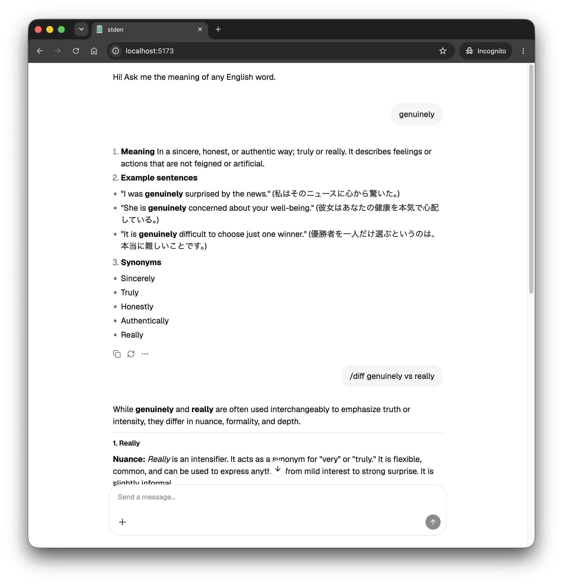

# stden

A personal English word explainer. Ask for a word's meaning and get definitions,
example sentences, a Japanese translation, and synonyms — with results cached
in Postgres so repeat lookups are instant.

- **Backend** — Fastify + Prisma (Postgres), Google Gemini for generation
- **Frontend** — React 19 + Vite + Tailwind, assistant-ui chat interface
- **Monorepo** — pnpm workspaces (`apps/backend`, `apps/frontend`)

